# 🎯 ISHARA - Indian Sign Language Translator

<div align="center">

**Empowering communication for millions through AI-powered Indian Sign Language (ISL) recognition**

[](https://www.python.org/)
[](https://reactjs.org/)
[](https://www.typescriptlang.org/)
[](https://www.tensorflow.org/)
[](https://fastapi.tiangolo.com/)

[Features](#-features) • [Installation](#-installation) • [Usage](#-usage) • [Tech Stack](#-tech-stack) • [Contributing](#-contributing)

</div>

---

## 📋 Table of Contents

- [About](#-about)
- [Problem Statement](#-problem-statement)
- [Solution](#-solution)
- [Features](#-features)
- [Core Components](#-core-components)
- [Tech Stack](#-tech-stack)
- [Installation](#-installation)
- [Usage](#-usage)
- [Project Structure](#-project-structure)
- [Screenshots](#-screenshots)
- [Contributing](#-contributing)
- [Acknowledgments](#-acknowledgments)

---

## 🎯 About

**ISHARA** is an innovative real-time Indian Sign Language (ISL) translation system that bridges communication barriers for millions of individuals with hearing and speech impairments in India. Unlike American Sign Language (ASL), which has extensive technological support, ISL has been largely underserved. ISHARA aims to change that by providing a comprehensive, user-friendly platform for sign language recognition, translation, and learning.

### Key Highlights

- 🏆 **Awarded by the Hon'ble Governor of Uttar Pradesh** for innovation
- 🎓 **Recognized by UttarPradesh Innovation Hub** with mentoring support
- 🤖 **AI-Powered** real-time gesture recognition using deep learning
- 🌐 **Multilingual Support** with Google Translate API integration
- 📚 **Interactive Learning Module** for ISL education

---

## 🧩 Problem Statement

Millions of individuals in India with hearing and speech impairments face daily communication barriers. While American Sign Language (ASL) has been extensively researched and supported by technology, **Indian Sign Language (ISL) lacks such development**.

### Our Mission

To build a real-time, user-friendly ISL Translator that:

1. ✅ Recognizes ISL gestures using a standard webcam (no gloves, Kinect, or special hardware required)
2. ✅ Bridges the gap between ISL users and non-signers
3. ✅ Promotes ISL learning and inclusivity

---

## 💡 Solution

Despite limited datasets and language variation across regions, ISHARA addresses these challenges through:

1. **Data Collection & Curation**: Collecting and curating ISL gesture data from various internet sources
2. **Advanced ML Algorithms**: Applying state-of-the-art ML algorithms like CNN and LSTM for gesture classification
3. **Computer Vision**: Utilizing computer vision techniques for real-time gesture detection
4. **End-to-End System**: Building a comprehensive system supporting sign-to-text/speech and text/speech-to-sign translation

---

## ✨ Features

### Core Capabilities

- 🔤 **Real-Time Gesture Detection** - Advanced hand tracking using OpenCV and MediaPipe
- 🗣️ **Sign Language to Text & Speech** - Instant conversion of gestures to text and audio
- 📢 **Text/Speech to ISL Animation** - Reverse translation with animated sign representations
- 📚 **Interactive ISL Learning Module** - Visual reference guide for static gestures (A–Z, 1–9)
- 🌐 **Multilingual Support** - Integration with Google Translate API for multiple languages
- 👤 **User Authentication** - Secure user accounts with Firebase
- 📊 **Progress Tracking** - Dashboard for learning progress and statistics

### Technical Features

- ⚡ **Fast Inference** - Optimized TensorFlow models for real-time performance
- 🎥 **Webcam Integration** - No special hardware required
- 🔄 **Bidirectional Translation** - Both sign-to-text and text-to-sign capabilities
- 📱 **Responsive Design** - Works seamlessly on desktop and mobile devices
- 🎨 **Modern UI/UX** - Built with React and Tailwind CSS

---

## 🧩 Core Components

| Component | Description |
|-----------|-------------|
| **✋ Sign-to-Text/Speech** | Real-time detection of hand gestures via webcam and conversion to text or audio output |
| **🗣️ Speech/Text-to-Sign** | Converts spoken or typed language into ISL using animated sign representations |
| **📚 Learn ISL** | Visual reference library of static gestures (A–Z, 1–9) to promote ISL literacy |

---

## 🛠️ Tech Stack

### Frontend

| Technology | Purpose |
|------------|---------|
| **React 18** | Modern UI framework for building interactive user interfaces |
| **TypeScript** | Type-safe JavaScript for better code quality |
| **Vite** | Fast build tool and development server |
| **Tailwind CSS** | Utility-first CSS framework for rapid UI development |
| **MediaPipe** | Real-time hand tracking and gesture recognition |
| **TensorFlow.js** | Client-side machine learning inference |
| **Firebase** | Authentication, Firestore database, and storage |
| **React Router** | Client-side routing |

### Backend

| Technology | Purpose |
|------------|---------|
| **Python 3.10** | Core backend programming language |
| **FastAPI** | Modern, fast web framework for building APIs |
| **TensorFlow 2.13** | Deep learning framework for model inference |
| **OpenCV** | Real-time camera input and frame processing |
| **YOLOv8** | Sign detection using object detection |
| **CNN/LSTM** | Gesture recognition neural networks |
| **Google Translate API** | Multilingual translation support |
| **Uvicorn** | ASGI server for FastAPI |

### Machine Learning

| Component | Description |
|-----------|-------------|
| **CNN (Convolutional Neural Network)** | Gesture classification and recognition |
| **LSTM (Long Short-Term Memory)** | Sequential gesture pattern recognition |
| **MediaPipe Hands** | Real-time hand landmark detection |
| **Custom ISL Dataset** | Trained models for Indian Sign Language |

### Google Technologies

| Technology | Purpose | Location/Usage |
|------------|---------|----------------|
| **Google Translate API** | Multilingual text translation (Hindi, Bengali, Marathi, Assamese, Punjabi, Bhojpuri, etc.) | `backend/main.py` - Translates speech/text to English for sign conversion |
| **Firebase Authentication** | User authentication with Google Sign-In | `src/firebase.ts`, `src/contexts/AuthContext.tsx` - Secure user login |
| **Firebase Firestore** | Cloud database for user data and profiles | `src/firebase.ts` - Stores user information and preferences |
| **Firebase Storage** | Cloud file storage service | `src/firebase.ts` - Handles file uploads and media storage |
| **MediaPipe** | Real-time hand tracking and gesture recognition | `src/hooks/useHandTracker.ts` - Hand landmark detection for sign recognition |
| **Google Cloud Storage** | CDN hosting for MediaPipe models | MediaPipe model files accessed via `storage.googleapis.com` |
| **Google Fonts** | Web typography (Inter font family) | `index.html` - Modern, readable typography |

---

## 🚀 Installation

### Prerequisites

Before you begin, ensure you have the following installed:

- **Node.js** (v18 or higher) - [Download](https://nodejs.org/)
- **Python** (v3.10 or higher) - [Download](https://www.python.org/downloads/)
- **npm** or **yarn** (comes with Node.js)
- **pip** (Python package manager)
- **Git** - [Download](https://git-scm.com/downloads)
- **Webcam** (for testing sign language recognition)
- **Modern web browser** (Chrome, Firefox, Edge, or Safari recommended)

### Step 1: Clone the Repository

```bash
git clone <repository-url>
cd ISHARA
```

### Step 2: Frontend Setup

```bash
# Install frontend dependencies
npm install

# Start the development server
npm run dev
```

The frontend will be available at `http://localhost:5173` (or the port shown in the terminal).

### Step 3: Backend Setup

```bash
# Navigate to backend directory
cd backend

# Create a virtual environment (recommended)
python -m venv venv

# Activate virtual environment
# On Windows:
venv\Scripts\activate
# On Linux/Mac:
source venv/bin/activate

# Install Python dependencies
pip install -r requirements.txt

# Verify model files are present
# Check for: linux.h5, krishnav.pkl in the backend directory
ls -la *.h5 *.pkl

# Start the FastAPI server
uvicorn main:app --reload --port 8001
```

The backend API will be available at `http://localhost:8001`.

### Step 4: Environment Configuration

#### Frontend Environment Variables

Create a `.env` file in the root directory (if needed):

```env
VITE_API_URL=http://localhost:8001
```

#### Backend Environment Variables

The backend uses default configurations. Ensure:
- Model files (`linux.h5`, `krishnav.pkl`) are in the `backend/` directory
- All required dependencies are installed

#### Firebase Configuration

Firebase is pre-configured in `src/firebase.ts`. For production, update with your Firebase credentials:

```typescript
const firebaseConfig = {
  apiKey: "your-api-key",
  authDomain: "your-auth-domain",
  projectId: "your-project-id",
  storageBucket: "your-storage-bucket",
  messagingSenderId: "your-messaging-sender-id",
  appId: "your-app-id",
  measurementId: "your-measurement-id"
};
```

### Docker Setup (Alternative)

For a containerized setup, refer to the detailed [DOCKER_SETUP.md](./DOCKER_SETUP.md) guide.

**Quick Start:**

```bash
# Development environment
docker-compose -f docker-compose.dev.yml up --build

# Production environment
docker-compose up --build
```

---

## 📖 Usage

### Running the Application

1. **Start the Backend Server**:
   ```bash
   cd backend
   source venv/bin/activate  # or venv\Scripts\activate on Windows
   uvicorn main:app --reload --port 8001
   ```

2. **Start the Frontend** (in a new terminal):
   ```bash
   npm run dev
   ```

3. **Access the Application**:
   - Open your browser and navigate to `http://localhost:5173`
   - Allow camera permissions when prompted
   - Start using the sign language translator!

### Building for Production

#### Frontend Build

```bash
npm run build
```

The production build will be in the `dist/` directory.

#### Backend Production

```bash
# Use production ASGI server with multiple workers
uvicorn main:app --host 0.0.0.0 --port 8001 --workers 4
```

### API Documentation

Once the backend is running, access the interactive API documentation:

- **Swagger UI**: `http://localhost:8001/docs`
- **ReDoc**: `http://localhost:8001/redoc`

---

## 📁 Project Structure

```
ISHARA/
├── backend/                 # Python FastAPI backend
│   ├── main.py             # FastAPI application entry point
│   ├── requirements.txt    # Python dependencies
│   ├── linux.h5            # Trained model file
│   └── krishnav.pkl        # Model encoder/configuration
├── src/                    # React frontend source code
│   ├── components/         # React components
│   ├── pages/             # Page components
│   ├── hooks/            # Custom React hooks
│   ├── contexts/          # React contexts (Auth, Theme)
│   ├── lib/               # Utility libraries
│   ├── utils/             # Helper functions
│   └── firebase.ts        # Firebase configuration
├── public/                # Static assets
├── ScreenShots/           # Project screenshots
├── Dockerfile.backend     # Backend Docker configuration
├── Dockerfile.frontend    # Frontend Docker configuration
├── docker-compose.yml     # Production Docker setup
├── docker-compose.dev.yml # Development Docker setup
└── README.md             # This file
```

---

## 📸 Screenshots

### 🧑‍💼 About ISHARA
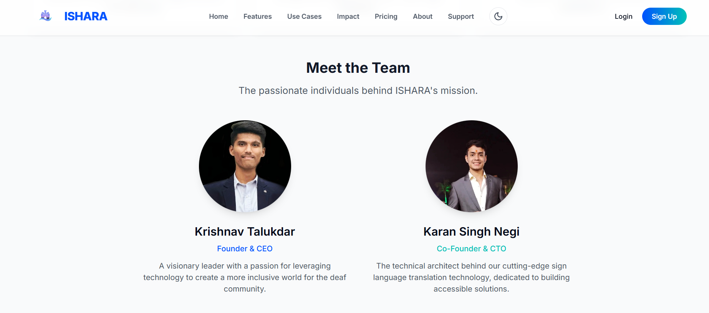

### 🏠 Home Page
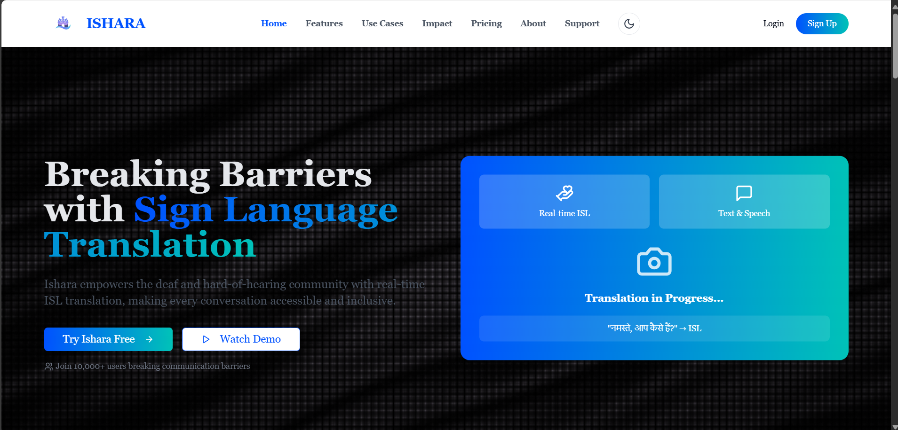

### 🖥️ Dashboard
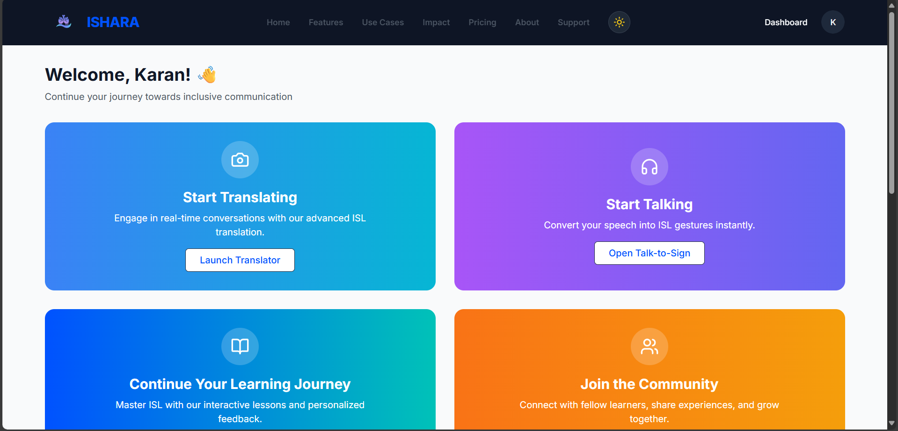

### 🚀 Features
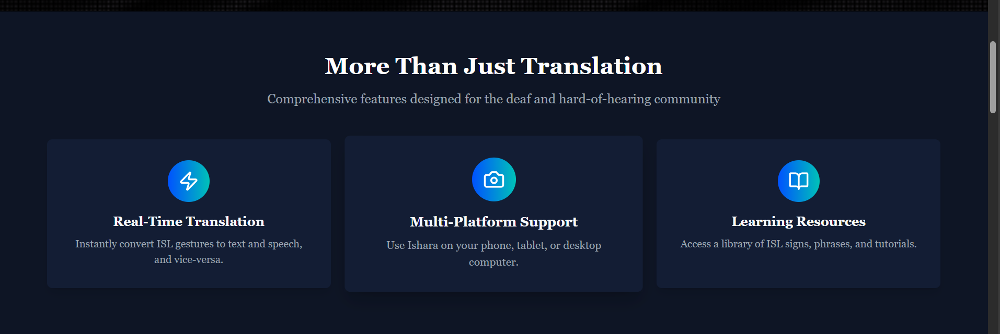

### 🤖 Sign to Text Implementation
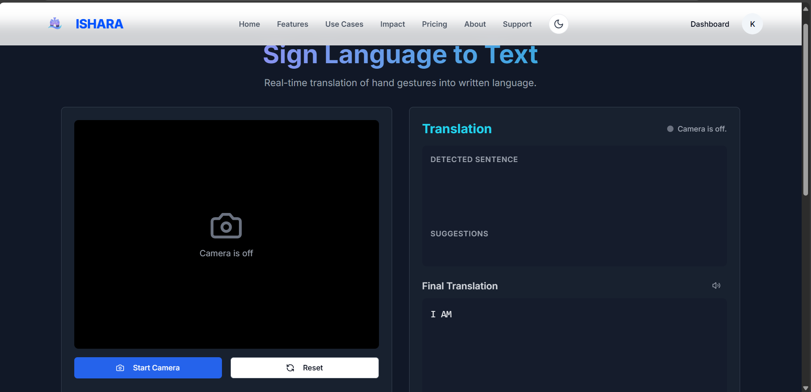
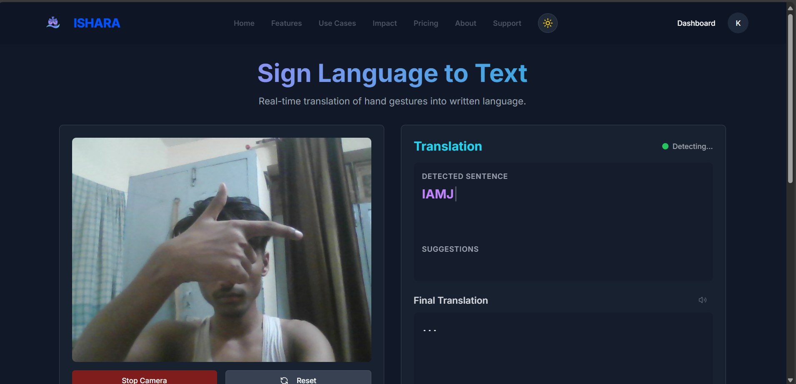

### 🔊 Voice to Sign - UI
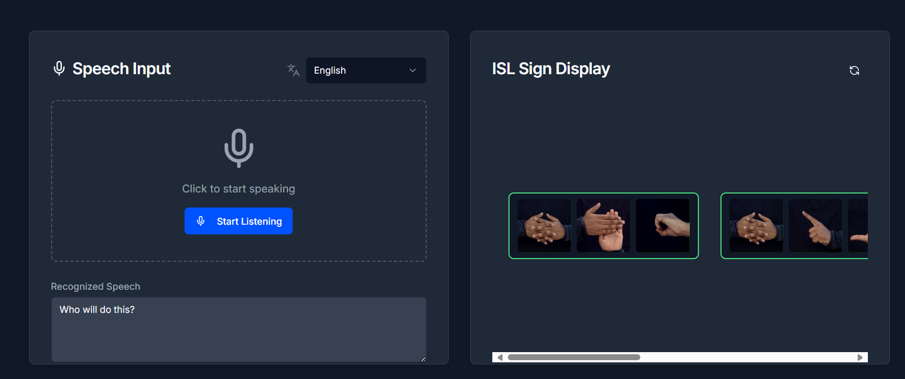
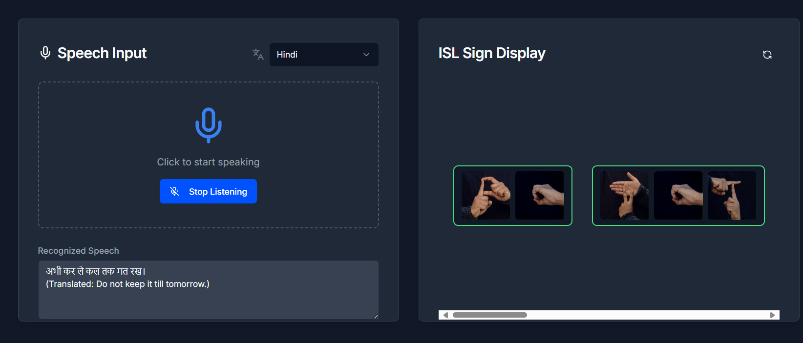
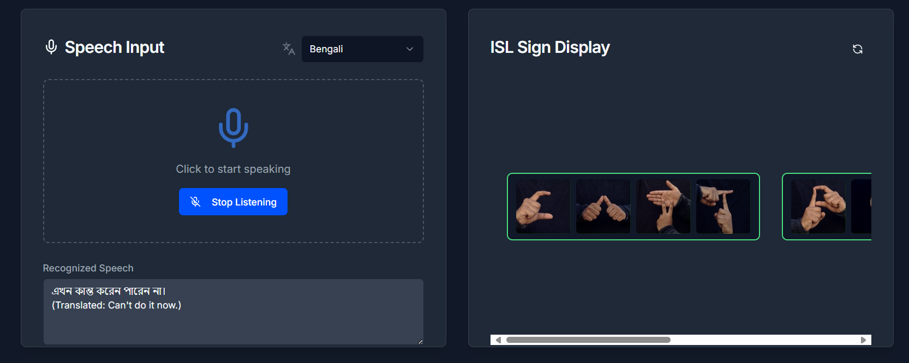

### 📘 Learning Page
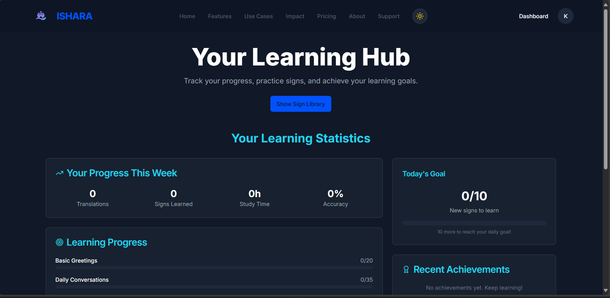

### 👤 Profile
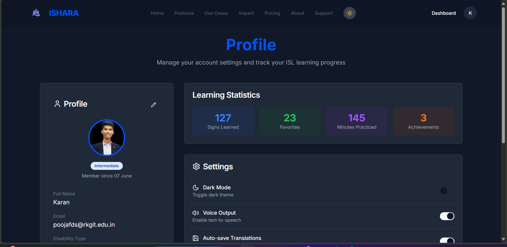

### 💡 USP (Unique Selling Point)
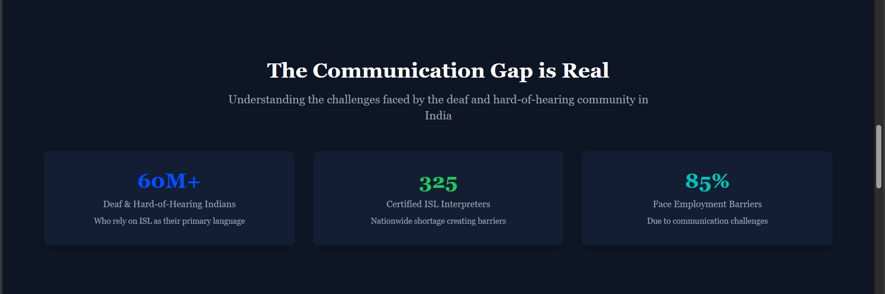

---

## 🔧 Troubleshooting

### Common Issues

#### 1. Camera Not Working
- ✅ Ensure you've granted camera permissions in your browser
- ✅ Check if another application is using the camera
- ✅ Try using HTTPS (some browsers require HTTPS for camera access)
- ✅ Use Chrome or Edge for best MediaPipe hand tracking performance

#### 2. Backend Connection Errors
- ✅ Verify the backend is running on port 8001
- ✅ Check if the port is already in use:
  ```bash
  # Linux/Mac
  lsof -i :8001
  # Windows
  netstat -ano | findstr :8001
  ```
- ✅ Ensure CORS is properly configured in the backend

#### 3. Model Files Missing
- ✅ Verify `backend/linux.h5` and `backend/krishnav.pkl` exist
- ✅ Check file permissions
- ✅ Ensure files are not corrupted

#### 4. Python Dependencies Issues
- ✅ Use Python 3.10 specifically (TensorFlow compatibility)
- ✅ Upgrade pip: `pip install --upgrade pip`
- ✅ On some systems, use: `pip install tensorflow-cpu==2.13.0`

#### 5. Node.js Version Issues
- ✅ Ensure Node.js v18 or higher is installed
- ✅ Use `nvm` (Node Version Manager) to switch versions if needed
- ✅ Clear node_modules and reinstall: `rm -rf node_modules && npm install`

#### 6. Firebase Authentication Errors
- ✅ Verify Firebase configuration in `src/firebase.ts`
- ✅ Check Firebase console for API key restrictions
- ✅ Ensure Firebase project has Authentication and Firestore enabled

### Getting Help

- 📖 Check the [DOCKER_SETUP.md](./DOCKER_SETUP.md) for Docker-specific issues
- 📝 Review backend logs for API errors
- 🔍 Check browser console for frontend errors
- ✅ Ensure all dependencies are correctly installed

### Development Tips

- 🔄 **Hot Reload**: Both frontend (Vite) and backend (uvicorn --reload) support hot reloading
- 📚 **API Testing**: Backend API docs available at `http://localhost:8001/docs` (Swagger UI)
- 🤖 **Model Training**: Model files (`linux.h5`, `krishnav.pkl`) should be in the `backend/` directory
- 🌐 **Browser Compatibility**: Use Chrome or Edge for best MediaPipe hand tracking performance

---

## 🤝 Contributing

We welcome contributions to ISHARA! Here's how you can help:

1. **Fork the repository**
2. **Create a feature branch** (`git checkout -b feature/AmazingFeature`)
3. **Commit your changes** (`git commit -m 'Add some AmazingFeature'`)
4. **Push to the branch** (`git push origin feature/AmazingFeature`)
5. **Open a Pull Request**

### Contribution Guidelines

- Follow the existing code style and conventions
- Write clear commit messages
- Add tests for new features when possible
- Update documentation as needed
- Be respectful and inclusive in all interactions

---

## 🙏 Acknowledgments

This project represents a significant step toward inclusive communication and digital accessibility for the hearing and speech impaired community in India.

### Recognition

- 🏆 **Awarded by the Hon'ble Governor of Uttar Pradesh** for innovation in assistive technology
- 🎓 **Recognized by UttarPradesh Innovation Hub** with mentoring and guidance support

### Special Thanks

We extend our gratitude to:
- The AKTU Innovation Hub for their support and mentorship
- The Indian Sign Language community for their feedback and collaboration
- All contributors and supporters of this project

---

## 📄 License

This project is licensed under the MIT License - see the LICENSE file for details.

---

## 📞 Contact & Support

For questions, suggestions, or support:

- 📧 Email: [talukdarkrishnav9@gmail.com]
- 💬 Issues: [GitHub Issues](https://github.com/your-repo/issues)
- 📱 Website: [https://kridikshit.onrender.com/]

---

<div align="center">

**Made with ❤️ for the Indian Sign Language Community**

⭐ Star this repo if you find it helpful!

</div>
